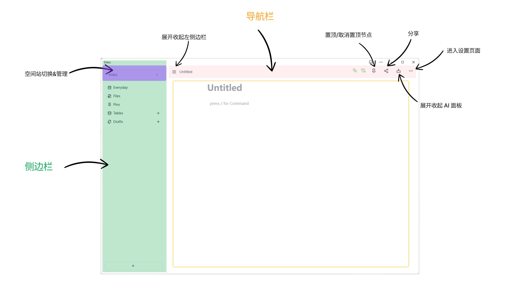
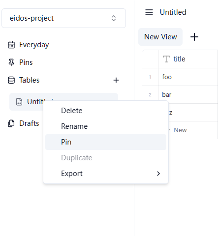
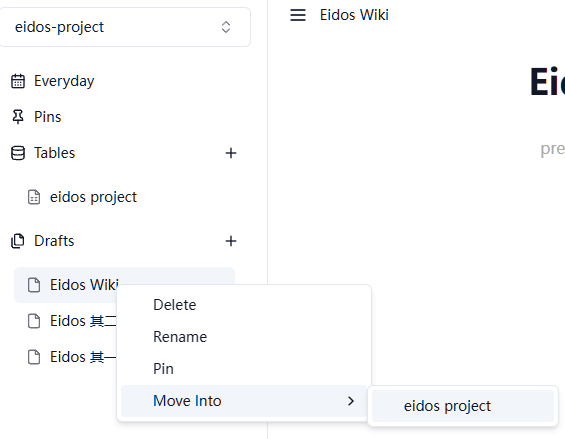
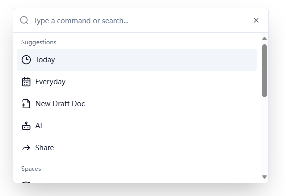

# 概览

## 侧边栏

以左侧边栏为引导介绍各个模块

### Everyday

展示最近的日志，点击日期，可以进入当天的日志查看和编辑。

Everyday 是日常记录的地方，希望你可以把每天你认为有意义的事情记录下来。如果你认为是流水性质的内容，大部分可以记录在这里。如果你不知道记在哪里，放这里就行了。希望你在记录时不要有压力。

:::tip

- 日志本质上是以日期为 ID 的文档，并且不可更改标题。
- 在分享状态下，日志对访问者不可见。
- 倾向于记录零散的所思所想

:::

### Files(beta)

需要在 [实验性功能](https://eidos.space/settings/experiment) 中配置开启。

Eidos 中所有的静态文件资源都存储在 [OFPS](/faq/how-data-store) 中，Files 是一个文件管理器，提供轻量级的文件查看和管理功能。通过粘贴拖拽到文档和表格文件字段的文件，都可以通过 Files 查看管理。

你也可以自己建立文件夹，直接上传新的文件，比如新建一个 docs 目录，把自己电脑上的 PDF 文档全都放进去。

### Pins

在 Eidos 中文档和表格统称为节点(Node)， 你可以把任意的节点置顶，方便查看。

有两种方式置顶节点。

1. 右键侧边栏的目录树上的节点，选择 pin 即可置顶节点。

2. 导航栏的 pin 按钮触发。

:::tip

- 表格中每一行记录对应一份文档，这些文档不会出现在左侧目录树中，你可以通过导航栏的 pin 按钮将其置顶

:::

### Tables

是表格部分，当你有结构化的数据，excel/csv 等类型的文件，可以放这里，同时也可以用数据库的模式组织文档。

### Drafts

草稿，新建一份文档。没想好归属的文档可以放这里。等你完稿或者想清楚后，可以 move 到指定的表格。

## CMDK

通过 `ctrl/cmd` + `K` 唤起快捷操作面板。

