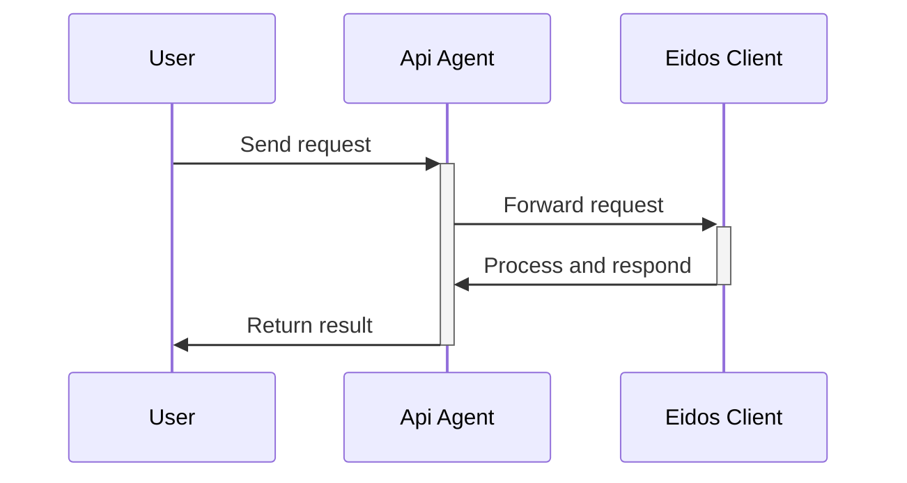

# Eidos API

In traditional services, the database is in the cloud, and the API is available 24/7. Eidos is a Web App, which does not inherently have the ability to provide an API. We handle API requests through a proxy service, which then forwards the requests to the Eidos Web Client, enabling data read and write.

Any HTTP Client \<== http ==> Eidos API Agent \<== websocket ==> Eidos Web Client



## Open Source Implementation

A simple node implementation, deploy it locally or in the cloud to use the API.

https://github.com/mayneyao/eidos-api-agent-node

## Official Service

- No deployment required, use directly
- 24/7 availability
- Request caching
  - When the Eidos client is offline, we will cache the request and replay it when the Eidos client is online. Supports 7 days of API request caching (When the Agent receives an API request, if it finds that no client is online, it will cache this request, the maximum cache time is 7 days, at any time within 7 days if a client comes online, it will immediately replay the cached request, after the API request is consumed, it will be deleted from the cache).
  - This solution is suitable for data inflow scenarios, such as: saving clipped documents, synchronizing data from other services to Eidos. If it involves data queries, the Eidos client still needs to be online.

## How to call the API

You can use any of the following functions to query data from the database:

- sqlQuery
- listTreeNodes
- updateTreeNodeName
- ...

To see all the available functions, refer to the DataSpace.ts file.

To post a data query to the server, send the data in JSON format:

```js
{
    "space": "<database name>",
    "method": "sqlQuery",
    "params": ["select \* from tb_44d6193623544426873507e10f3cfd7f", [], "object"]
}
```

- space: The name of the database. `str`
- method: The name of the function. `str`
- params: The parameters of the function. `list`

One of the most useful functions is sqlQuery, which allows you to query data from the database:

```py
r = requests.post('http://localhost:3333/rpc', json={
    'space': 'eidos',
    'method': 'sqlQuery',
    'params': [
        'select * from tb_44d6193623544426873507e10f3cfd7f where _id = ?;',
        [
            '5f8b3b6b3b3d4a3e8c4b4b2b4b4b4b4b',
        ],
        'object'
    ]
})
data = r.json()
for row in data['data']['result']:
    print(row['cl_xu38'])
```

## SDK

Eidos provides Python/TypeScript SDK, making it more intuitive for developers to use the Eidos API.

See:

- [Python SDK](/tech/sdk-python)
