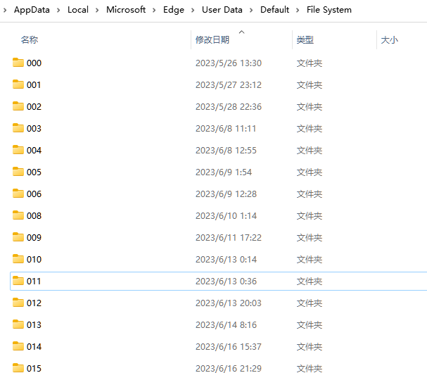

# Eidos 数据存储设计

## 存储在哪里？

Eidos 的数据均存储在 OPFS 中，你可以通过 [OPFS Explorer](https://chrome.google.com/webstore/detail/opfs-explorer/acndjpgkpaclldomagafnognkcgjignd) 查看。

OPFS 是浏览器的私有文件系统，对用户并不可见。但是不必担心，你仍然可以随时查看、导出你的数据。你可以理解为 OPFS Explorer 就是浏览器的文件资源管理器或者 Finder。

### 具体存在那里？

OFPS 是 Web 虚拟出来的一套文件系统，具体到用户操作系统上，数据存储在哪里？

以 windows 平台下的 Edge 浏览器为例：

`%LocalAppData%\Microsoft\Edge\User Data\Default\File System`

例如: C:\Users\eidos\AppData\Local\Microsoft\Edge\User Data\Default\File System



如图所示，你只能看到一些文件块，无法直接访问原始文件。

## 怎么存？

文件目录设计

```
- root
  - spaces
    - <SpaceName>
      - db.sqlite
      - files
        - abc.jpg​
```

### db.sqlite

每一个空间站的数据单独存储在以空间命名的目录下。空间站中所有的表格文档都存储在 `spaces/<spaceName>/db.sqlite` 中，你可以通过任意 sqlite 客户端查看其中的数据。

**Meta 表**

- `eidos__tree` 存储目录树信息
- `eidos__files` 存储文件元信息
- ...

**_所有以 eidos\_\_ 开头的表是存储运行的关键依赖，在 API 操作时，请务必小心，尽量只做只读操作，除非你明确知道你自己在干什么。_**

**用户建立的多维表格**

如果表格 id 为 4f4c747f55f74a289d1b56304a7cae21，那么 tablename 为 tb_4f4c747f55f74a289d1b56304a7cae21

### files

静态资源默认全部平铺存储在 files 目录下。files 按空间站独立划分。
你可以进入 files explorer 管理文件，你可以新建文件夹，并且操作文件夹。但是请注意，删除、重命名、移动文件可能让对其引用的文档，表格出现展示异常。

所有 opfs 的文件基础信息都会备份在 `eidos__files` 表格中。
