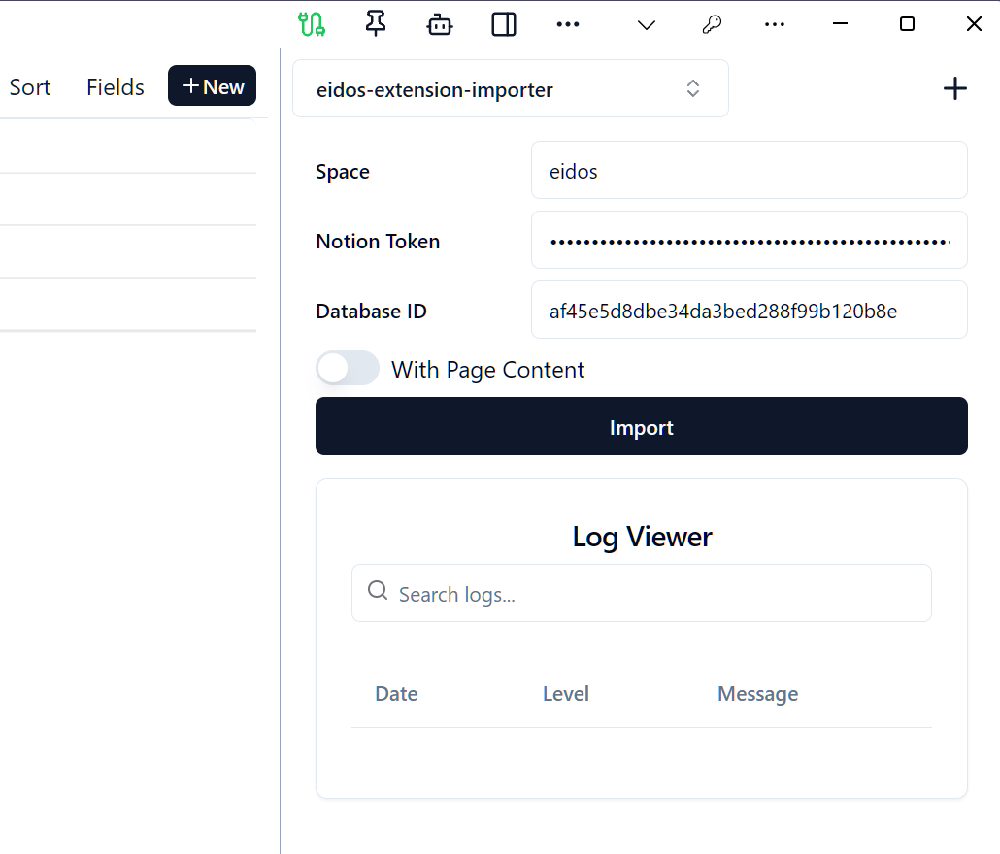
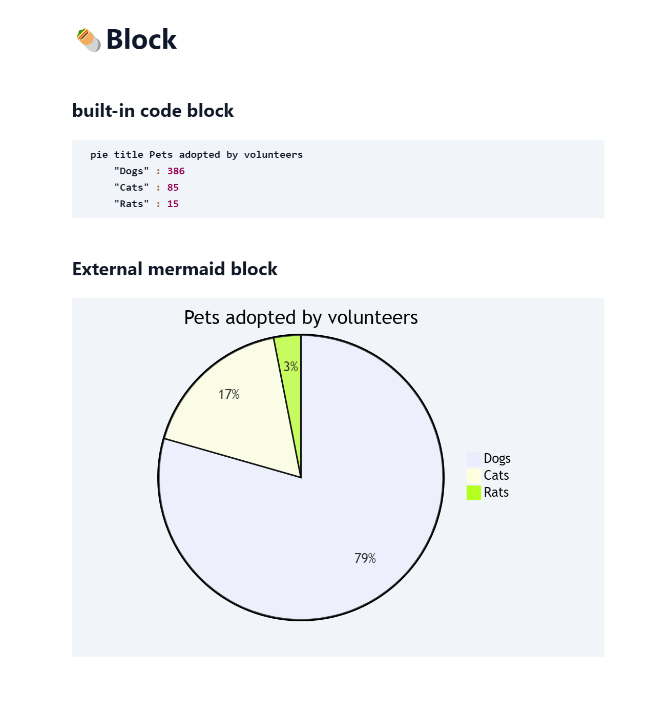
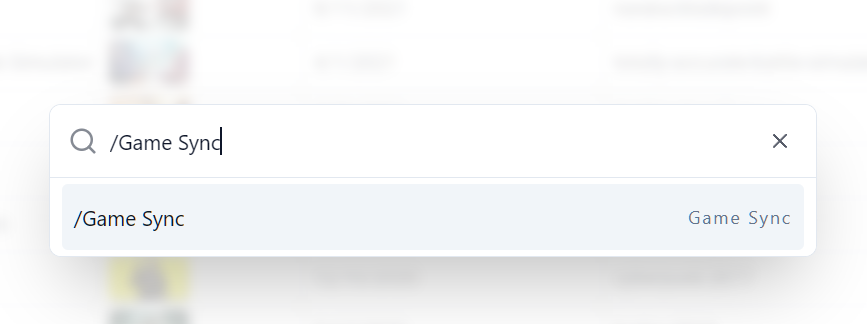
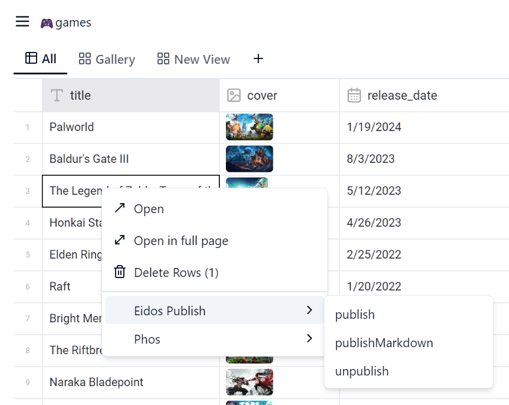
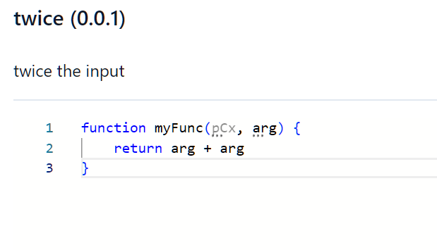
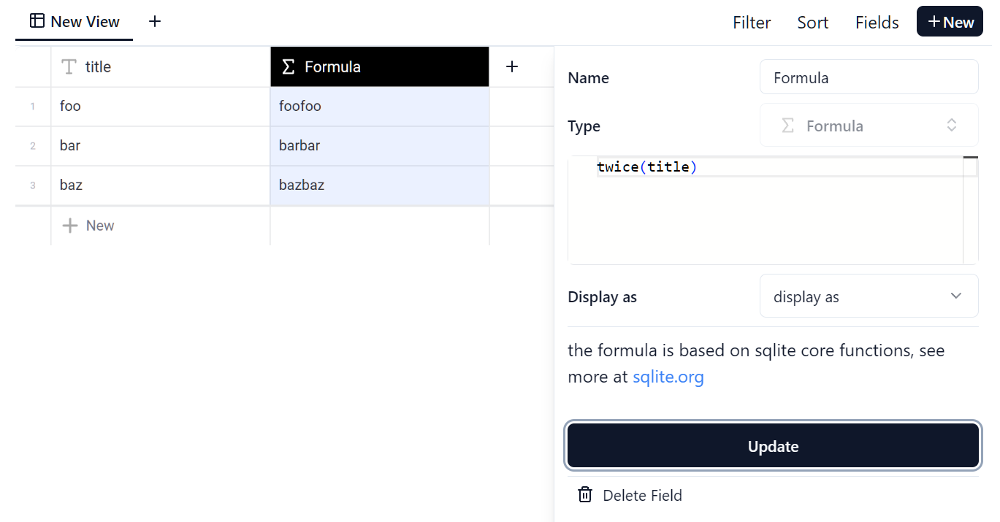

# Eidos Extension Mechanism

Eidos places great emphasis on extensibility. Adhering to the principle of Extension First, Eidos will modularize its features as much as possible, allowing developers to freely extend and customize. Eidos Core will only focus on the development of document and table functions, making it minimally viable and sufficiently stable. Other upper-layer applications are implemented through extensions.

Eidos provides a variety of extension modes, and you can customize almost any function.

1. App - Extend Eidos functionality in the form of sidebar UI, similar to browser plugins. It can interact with Eidos, implement operations on documents and tables, and display data.
2. Block - Define document Block, which can be used to extend document functions.
3. Field - Define table Field, which can be used to extend table column types.
4. Prompt - Custom prompts for interaction with LLM.
5. Script - Script is another way to extend functionality in Eidos. It is a UI-less App that can be used to implement automation, batch processing, etc., focusing on data processing and automation.
6. UDF - User Defined Function, which can be used to extend Eidos table formulas.

## App

Developers can write apps using any web technology stack, or they can integrate existing apps into the Eidos SDK, transforming them into Eidos Apps, enabling data operations and persistence. Developers do not need to worry about deployment issues, the experience is similar to browser extensions.

The following figure shows an app in the sidebar that can import notion data. Users can perform UI operations in the app and then import the data into Eidos.

## Block

Eidos provides an extension mechanism for Block, which can be used to extend document functions. Developers can implement custom document blocks through Block extensions.

https://github.com/mayneyao/eidos-mermaid-block

## Field

Eidos provides a rich variety of table column types, but sometimes users may need custom column types, which can be implemented through Field extensions.

## Prompt

## Script

Script is another way to extend functionality in Eidos. It is a UI-less App that can be used to implement automation, batch processing, etc., focusing on data processing and automation.

1. Provide a context menu item in the table to trigger the script, and users can choose to execute the script.
   1. 
2. Execute the script through CMDK `/<command>`.
   1. 

## UDF

User Defined Function, which can be used to extend Eidos table formulas.

## References

- https://github.com/mayneyao/eidos-extension-importer App for importing third-party data
- https://github.com/mayneyao/eidos-script-template Script writing template repository
- https://github.com/mayneyao/eidos-mermaid-block Example of mermaid block
