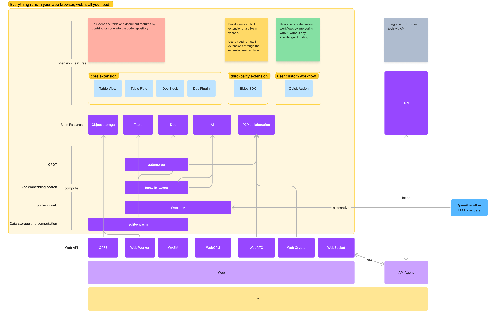

# Eidos 技术架构

Eidos 的核心基于 web 构建，是一个完全运行在 web 中的 app。

一些技术选型的原则

1. 零运维成本的、开箱即用的、轻量的、对开发者友好简单的。

   1. 没有 docker，不用启动数据库、启动服务器。
   2. 没有 monorepo， pnpm dev 本地就能开发运行，无需任何环境配置，web 打开就能用。

2. web-first
   1. 通过 web 跨平台，PWA 实现离线支持。
   2. 与传统 bs 架构不同，“服务端” 被实现在 web 的 worker 中。web client 才是本位。
      1. web client 没办法提供 http 的 api，所以我们通过 websocket 和一个 [api](api) agent 连接一次来提供 api 服务。api 依赖 web client 运行，而不是 client 依赖 server api 运行。你可以理解为 server 从云端转移到了 web worker 中。
3. local-first
   1. 网络是可选项。对于无法只依赖本地 web 实现的功能，倾向于使用 serverless 服务实现。
      1. web 端没有办法跨域查看图片，所以我们通过 cf worker 实现图片的反代。图片缓存在 OPFS 中，保证离线时候的浏览体验。

## WASM & Worker

- sqlite-wasm
  - sqlite-wasm 的 vfs + web opfs，使得我们可以在 web 上存储大量数据，查询和计算都是基于 sqlite 来实现的。
- hnswlib-wasm
  - 处理向量搜索

## OPFS

[Eidos 如何存储数据](data-store)

## WebRTC

WebRTC 把 p2p 带到了 web 中，我们以此实现去中心化的数据同步和协作
