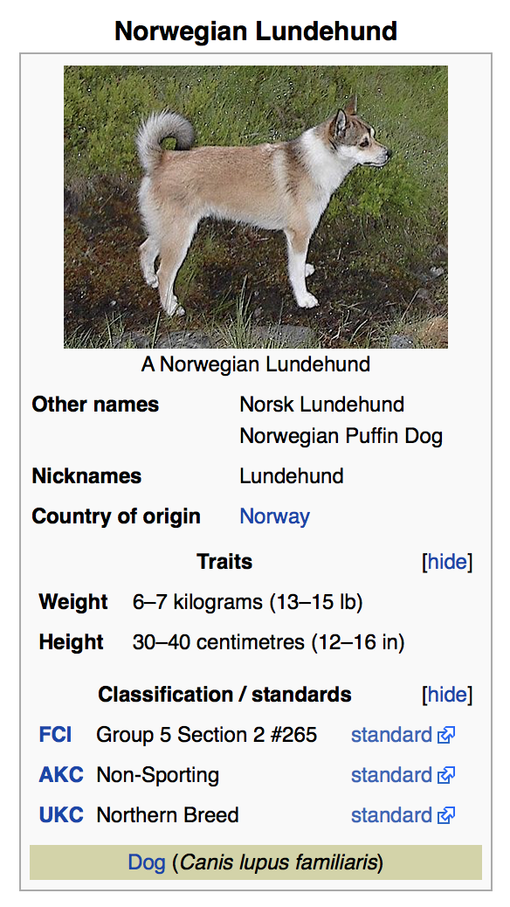

# Link

link 确切的来说是 linked-data

## Mediawiki

我在大学期间沉迷一款游戏 —— Guild Wars 2，在其中花费了大量的时间。出于热爱，我发起了[中文 wiki](https://gw2.huijiwiki.com/) 的项目。此时接触到 [Mediawiki](https://www.mediawiki.org/wiki/MediaWiki) ， 也就是维基百科背后运行的程序，维基百科有一个崇高的目标：全面收集世界上所有的知识。Mediawiki 正好能能胜任这个任务。游戏维基其实是个小众的爱好，并不像维基百科一样关乎人类大义，只是一群游戏玩家用爱发电的产物。但是这没关系，就像有些人喜欢运动并不是为了去奥运会拿奖牌一样。

### Semantic MediaWiki

Semantic MediaWiki 是全球范围内应用最为广泛的 Mediawiki 数据查询扩展。简单来说，每个页面都有自己的属性。这种做法是将结构化的数据维护在文档中，而不是在数据表中。你可以使用 wiki 的标记语法为页面设置属性。 `{{#set:<属性名称>=<属性数值>}}` 然后在其他页面查询出来 `{{#show:<页面名称>|?<属性名称>|link=}}` 。

这解决的是数据冗余和数据更新不及时的问题，wiki 中的信息时常发生变更。如果 A 从 B 引用了一段文字，当 B 的文字内容变更时，A 没法及时更新，就会造成信息滞后，失去时效性。

这里其实和面向对象编程的概念很类似了，如果你把一个页面当成一个对象，那些设置在这个页面上的属性，就是这个对象的属性。这个对象的属性可以被其他对象引用，这样就可以保证数据的一致性，而不仅仅只是相同文字的复制粘贴。熟悉 PKM 工具的人应该已经联想到了 Xanadu、双链之类的概念。

这段经历让我见识到了顶级的知识管理工具，PKM 个人知识管理算作是全人类知识管理的一个子集。因此对于后面新兴的双链笔记工具并不感冒，大家只不过是把古老的概念翻出来解构再重构一遍。

### Infobox

常见于 [infobox](https://en.wikipedia.org/wiki/Help:Infobox) 中。infobox 是 wiki 中非常重要的概念，一些结构的化的数据会以信息盒子的模式展示在页面中。

